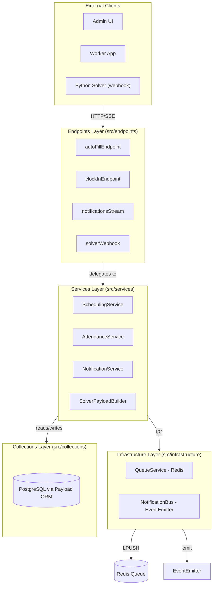

# Architecture

ShiftMatrix Backend follows a **Domain-Driven Design (DDD)** layered architecture adapted for Payload CMS. Each layer has a single responsibility and strict dependency rules.

---

## Layered Architecture Diagram

```
┌─────────────────────────────────────────────────────────────┐
│                        EXTERNAL CLIENTS                      │
│         (Admin UI, Worker App, Python Solver via webhook)    │
└────────────────────────┬────────────────────────────────────┘
                         │ HTTP / SSE
┌────────────────────────▼────────────────────────────────────┐
│                     ENDPOINTS LAYER                          │
│   src/endpoints/                                             │
│   ┌──────────────────┐  ┌──────────────────┐               │
│   │ autoFillEndpoint │  │ clockInEndpoint   │               │
│   ├──────────────────┤  ├──────────────────┤               │
│   │notificationsStream│  │ solverWebhook    │               │
│   └──────────────────┘  └──────────────────┘               │
│   • Validate HTTP input                                      │
│   • Extract auth / tenant context                            │
│   • Delegate to Services — NEVER contain business logic      │
└────────────────────────┬────────────────────────────────────┘
                         │ function calls
┌────────────────────────▼────────────────────────────────────┐
│                      SERVICES LAYER                          │
│   src/services/                                              │
│   ┌──────────────────────┐  ┌───────────────────────────┐  │
│   │  SchedulingService   │  │    AttendanceService       │  │
│   ├──────────────────────┤  ├───────────────────────────┤  │
│   │  NotificationService │  │  SolverPayloadBuilder      │  │
│   └──────────────────────┘  └───────────────────────────┘  │
│   • All domain business logic lives here                     │
│   • Pure functions preferred; side effects isolated          │
│   • May call Payload Local API for DB reads                  │
│   • May call Infrastructure layer for external I/O           │
└──────────────┬──────────────────────┬───────────────────────┘
               │ DB queries           │ I/O (Redis, EventEmitter)
┌──────────────▼──────┐  ┌───────────▼──────────────────────┐
│  COLLECTIONS LAYER  │  │       INFRASTRUCTURE LAYER         │
│  src/collections/   │  │       src/infrastructure/          │
│  (Payload schemas)  │  │  ┌─────────────┐ ┌──────────────┐ │
│  • Field definitions│  │  │ QueueService│ │Notification  │ │
│  • Access policies  │  │  │ (ioredis)   │ │Bus           │ │
│  • Collection hooks │  │  └─────────────┘ └──────────────┘ │
│  • Validators       │  │  • Wraps external systems (Redis,  │
└─────────────────────┘  │    EventEmitter, future SMS/Email) │
                         │  • No business logic               │
                         └────────────────────────────────────┘
```

### Mermaid version



---

## Layer Descriptions

### 1. Endpoints Layer (`src/endpoints/`)

**Role:** Thin HTTP controllers. The only responsibility is to translate HTTP ↔ function calls.

**Allowed to:**
- Parse and validate request body / query params
- Extract user / tenant from `req.user` (populated by Payload auth middleware)
- Call service functions
- Return HTTP responses (status + JSON)

**NOT allowed to:**
- Contain business logic (calculations, DB queries, distance math)
- Call infrastructure directly (no `getRedisClient()` from an endpoint)
- Import from other endpoints

**Files:**

| File | Route | Delegates to |
|---|---|---|
| `autoFillEndpoint.ts` | `POST /api/auto-fill` | `SchedulingService.enqueueSchedulingJob()` |
| `clockInEndpoint.ts` | `POST /api/time-logs/clock-in` | `AttendanceService.*` |
| `notificationsStream.ts` | `GET /api/notifications/stream` | `NotificationBus` (read-only listener) |
| `solverWebhook.ts` | `POST /api/shifts/solver-webhook` | Payload Local API + status updates |

---

### 2. Services Layer (`src/services/`)

**Role:** All domain business logic. This is the heart of the application.

**Allowed to:**
- Perform calculations (haversine, hours math, payload building)
- Call Payload's Local API for DB reads/writes
- Call infrastructure layer functions (`enqueueJob`, `emitNotification`)
- Import from `SolverPayloadBuilder` (utility module)

**NOT allowed to:**
- Handle HTTP concerns (no `req`, `res` references)
- Import from endpoints
- Import from collections (schemas are defined there; services use the Payload Local API or raw types)

**Files:**

| File | Purpose | Pure? |
|---|---|---|
| `SchedulingService.ts` | Orchestrate auto-fill: queries → builds payload → enqueues | No (DB + Redis) |
| `AttendanceService.ts` | Geofence, distance, late-check | Yes (pure math) |
| `NotificationService.ts` | Dispatch SSE notifications | No (EventEmitter) |
| `SolverPayloadBuilder.ts` | Build solver JSON from DB records | Yes (pure functions) |

---

### 3. Infrastructure Layer (`src/infrastructure/`)

**Role:** Adapters for external systems. Abstracts Redis and EventEmitter behind clean interfaces.

**Allowed to:**
- Manage connections (lazy, singleton)
- Wrap third-party clients
- Export simple function interfaces (not raw clients)

**NOT allowed to:**
- Contain business logic
- Import from services, endpoints, or collections

**Files:**

| File | Wraps | Key export |
|---|---|---|
| `QueueService.ts` | ioredis (Redis) | `enqueueJob(payload)` |
| `NotificationBus.ts` | Node `EventEmitter` | `notificationBus`, `emitNotification()` |

---

### 4. Collections Layer (`src/collections/`)

**Role:** Payload CMS schema definitions — field shapes, access control policies, and lifecycle hooks.

**Allowed to:**
- Define fields, validators, and default values
- Apply access control policies (importing from `src/access/tenant.ts`)
- Define collection hooks that call services (e.g., `afterChange` in `Notifications.ts`)

**NOT allowed to:**
- Contain business logic in hooks (delegate to services immediately)
- Import from endpoints or infrastructure

---

### 5. Access Layer (`src/access/tenant.ts`)

**Role:** Reusable access control policy factories for multi-tenant isolation.

Used exclusively inside collection definitions (`access: { read, create, update, delete }`).

---

## Dependency Rules (What Can Import What)

```
Endpoints  →  Services  →  Infrastructure
                       →  Collections (via Payload Local API)
Collections →  Access
Services   →  SolverPayloadBuilder (within services/)
```

**Strict rules:**
1. Infrastructure imports **nothing** from the layers above it.
2. Services import **nothing** from endpoints.
3. Endpoints import **nothing** from infrastructure directly.
4. Collections import **only** from `src/access/`.

Violating these rules creates circular dependencies and couples layers that should be independent.

---

## Why `engines/` is Deprecated

The `src/engines/` directory contains two files that predate the DDD refactor:

| File | What it did | Replaced by |
|---|---|---|
| `autoFillEngine.ts` | Monolithic auto-fill function (DB + logic mixed) | `SchedulingService` + `SolverPayloadBuilder` |
| `rulesEngine.ts` | In-process JS rule evaluation for shift constraints | `solver.py` CP-SAT model (Python microservice) |

**Why they were deprecated:**

1. **No separation of concerns** — both files mixed DB queries, business logic, and HTTP adapter code in single functions.
2. **Untestable** — pure logic was entangled with side effects, making unit testing impossible without a live DB.
3. **Scalability** — the JS rules engine evaluated constraints sequentially. The CP-SAT solver can handle hundreds of workers and slots in parallel via branch-and-bound.
4. **Maintainability** — the OR-Tools model in `solver.py` expresses constraints declaratively (e.g., `AddExactlyOne`, `AddImplication`) which is far more readable than imperative JS loops.

> ⚠️ **Do not import anything from `src/engines/`.** These files will be removed in a future cleanup PR.

See `src/engines/DEPRECATED.md` for the migration history.

---

## Data Flow Summary

```
HTTP POST /api/auto-fill
        │
        ▼
autoFillEndpoint.ts          (validate input, extract tenantId)
        │
        ▼
SchedulingService
  enqueueSchedulingJob()     (5 DB queries, build payload)
        │
        ├─► SolverPayloadBuilder  (pure: buildWorkerPayload, buildSlotsForShift)
        │
        ├─► Payload Local API     (create SchedulingRun record)
        │
        └─► QueueService
              enqueueJob()        (LPUSH → Redis)
                    │
                    ▼         (async, separate process)
              worker.py           (BRPOP → solve → HMAC sign)
                    │
                    ▼
HTTP POST /api/shifts/solver-webhook
                    │
                    ▼
              solverWebhook.ts    (verify HMAC, update DB)
```
