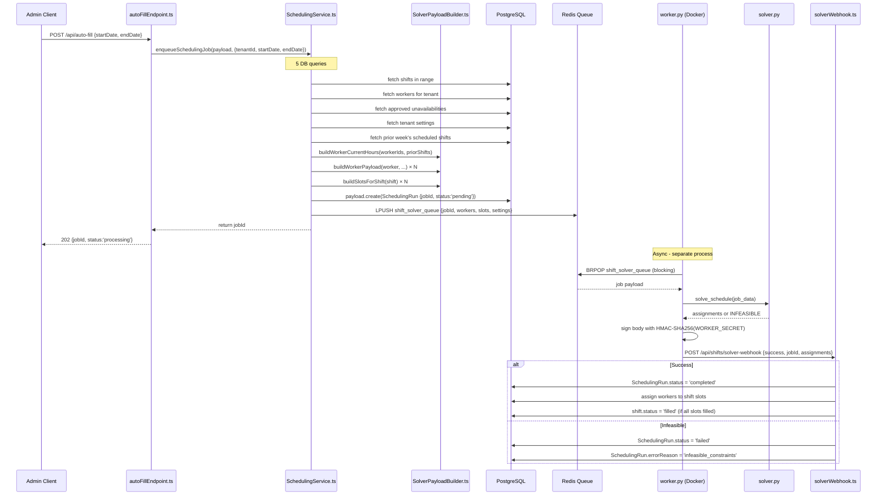

# Auto-Fill Solver

The auto-fill feature uses a Python CP-SAT constraint solver (Google OR-Tools) running as a Docker microservice. TypeScript enqueues a job via Redis; Python solves it and posts the result back via a HMAC-signed webhook.

---

## Complete Flow Diagram



---

## TypeScript → Python Payload Format

The job payload is a JSON object pushed to Redis. Python deserializes it with `json.loads()`.

### Top-level `SolverJobPayload`

```typescript
{
  jobId: string,           // UUID - used to call back the webhook
  tenantId: string,        // For webhook DB update context
  workers: SolverWorkerPayload[],
  slots: SolverSlotPayload[],
  settings: {
    defaultMaxWeeklyHours: number,
    activateUnionRestRules: boolean
  }
}
```

### `SolverWorkerPayload`

```json
{
  "workerId": "64f2a1b3c4d5e6f7a8b9c0d6",
  "certifications": ["RN", "BLS"],
  "maxWeeklyHours": 40,
  "currentWeeklyHours": 12.5,
  "unavailabilityBlocks": [
    { "startMs": 1706918400000, "endMs": 1706947200000 }
  ]
}
```

| Field | TypeScript type | Python type | Description |
|---|---|---|---|
| `workerId` | `string` | `str` | Payload document ID |
| `certifications` | `string[]` | `list[str]` | Cert abbreviations worker holds |
| `maxWeeklyHours` | `number` | `float` | Upper limit (hours) |
| `currentWeeklyHours` | `number` | `float` | Already-scheduled hours this week |
| `unavailabilityBlocks` | `{startMs, endMs}[]` | `list[dict]` | Unavailability windows (Unix ms) |

### `SolverSlotPayload`

```json
{
  "shiftId": "64f2a1b3c4d5e6f7a8b9c0d7",
  "blockIndex": 0,
  "role": "Registered Nurse",
  "requiredCerts": ["RN"],
  "startTime": "2025-02-03T08:00:00.000Z",
  "endTime": "2025-02-03T16:00:00.000Z",
  "startTimeMs": 1738569600000,
  "endTimeMs": 1738598400000
}
```

| Field | TypeScript type | Python type | Purpose |
|---|---|---|---|
| `shiftId` | `string` | `str` | For assignment mapping in webhook callback |
| `blockIndex` | `number` | `int` | Index within `shift.staffingRequirements` |
| `role` | `string` | `str` | Human-readable role label |
| `requiredCerts` | `string[]` | `list[str]` | Certs required for this slot |
| `startTime` | `string` (ISO 8601) | `datetime` via `fromisoformat()` | Duration calculation |
| `endTime` | `string` (ISO 8601) | `datetime` via `fromisoformat()` | Duration calculation |
| `startTimeMs` | `number` (Unix ms) | `int` | Integer gap arithmetic in CP-SAT |
| `endTimeMs` | `number` (Unix ms) | `int` | Integer gap arithmetic |

> **Why both `startTime` and `startTimeMs`?**
> Python uses `datetime.fromisoformat(startTime)` for human-readable duration display and debugging.
> `startTimeMs` (integer) is used directly in CP-SAT arithmetic — integers avoid floating-point errors in constraint math.

---

## CP-SAT Constraints in `solver.py`

All constraints use the OR-Tools CP-SAT model. The decision variable is `x[(w, s)]` — a boolean indicating whether worker `w` is assigned to slot `s`.

### Constraint 1: Exactly one worker per slot

```python
for s in slots:
    model.AddExactlyOne(x[(w, s)] for w in workers)
```

Every slot **must** be filled by exactly one worker. This is a hard constraint — if it cannot be satisfied, the model reports `INFEASIBLE`.

### Constraint 2: Certification matching

```python
for w in workers:
    for s in slots:
        if not set(s['requiredCerts']).issubset(set(w['certifications'])):
            model.Add(x[(w, s)] == 0)
```

If a worker does not hold all certs required by a slot, they are **excluded** from that slot.

### Constraint 3: Maximum weekly hours

Hours are encoded as integers × 10 to support 0.5h precision without floats:

```python
SCALE = 10  # 1 hour = 10 units → 0.5h = 5 units

for w in workers:
    assigned_duration_scaled = sum(
        x[(w, s)] * slot_duration_scaled(s)
        for s in slots
    )
    remaining_hours_scaled = (w['maxWeeklyHours'] - w['currentWeeklyHours']) * SCALE
    model.Add(assigned_duration_scaled <= int(remaining_hours_scaled))
```

### Constraint 4: Unavailability blocking

```python
for w in workers:
    for s in slots:
        for block in w['unavailabilityBlocks']:
            if slots_overlap(s, block):
                model.Add(x[(w, s)] == 0)
```

If a slot overlaps any approved unavailability block for a worker, they cannot be assigned to that slot.

### Constraint 5: Union rest rules (conditional)

Activated only when `settings.activateUnionRestRules == true`:

```python
MIN_REST_MS = 12 * 60 * 60 * 1000  # 12 hours

if settings['activateUnionRestRules']:
    for w in workers:
        for s1 in slots:
            for s2 in slots:
                if s1 != s2:
                    gap = s2['startTimeMs'] - s1['endTimeMs']
                    if 0 < gap < MIN_REST_MS:
                        # If assigned s1, cannot also be assigned s2
                        model.AddImplication(x[(w, s1)], x[(w, s2)].Not())
```

Ensures workers have at least 12 hours rest between consecutive shift assignments.

---

## Handling Infeasible Schedules

When the CP-SAT solver reports `INFEASIBLE` (no solution satisfies all constraints):

**Python side (`solver.py`):**
```python
if status == cp_model.INFEASIBLE:
    return {"success": False, "reason": "infeasible_constraints"}
```

**Python worker (`worker.py`):** Signs the failure payload and POSTs to the webhook.

**TypeScript webhook (`solverWebhook.ts`):**
```typescript
await payload.update({
  collection: 'scheduling-runs',
  where: { jobId: { equals: body.jobId } },
  data: { status: 'failed', errorReason: body.reason },
})
```

**Common causes of infeasibility:**
- Too few workers with the required certifications
- Workers who are all unavailable during the shift window
- All workers would exceed `maxWeeklyHours` with additional assignments
- Union rest rules eliminate all remaining valid combinations

**Debugging:** Check the `SchedulingRun` record's `errorReason` field. Temporarily disabling `activateUnionRestRules` in tenant settings can help isolate whether rest rules are the cause.

---

## Python Solver Project Structure

```
src/solver_service/
├── Dockerfile           # python:3.11-slim, ENV PYTHONPATH=/app
├── docker-compose.yml   # two services: redis + solver
├── requirements.txt     # ortools>=9.6, redis>=4.6, requests>=2.28
├── solver.py            # CP-SAT model — solve_schedule(job_data)
├── worker.py            # BRPOP consumer — calls solver, posts webhook
└── test_solver.py       # 4 unittest cases
```

### `docker-compose.yml` services

```yaml
services:
  redis:
    image: redis:7-alpine
    ports:
      - "6379:6379"

  solver:
    build: .
    environment:
      - REDIS_URL=redis://redis:6379/0
      - WEBHOOK_URL=http://host.docker.internal:3000/api/shifts/solver-webhook
      - WORKER_SECRET=${WORKER_SECRET:-}
    depends_on:
      - redis
```

> `host.docker.internal` resolves to the host machine from inside Docker (Mac/Windows). On Linux, use `172.17.0.1` or `--add-host host.docker.internal:host-gateway`.

---

## Running and Testing the Solver

### Start the solver service

```bash
# From backend/
docker compose -f src/solver_service/docker-compose.yml up --build
```

### Run Python unit tests

```bash
docker compose -f src/solver_service/docker-compose.yml run \
  -v $PWD/src/solver_service:/app solver \
  python -m unittest test_solver
```

### Run the TypeScript integration test

```bash
npm run test:int -- --testPathPattern=autoFillAsync
```

The `autoFillAsync.int.spec.ts` test verifies:
1. `POST /api/auto-fill` returns `202` with a `jobId`
2. A mock webhook call updates the `SchedulingRun` to `completed`

### Manual end-to-end test

```bash
# 1. Ensure Redis + PostgreSQL are running
# 2. Start the backend
npm run dev

# 3. Start the solver Docker service
docker compose -f src/solver_service/docker-compose.yml up

# 4. Log in as admin, get JWT
curl -X POST http://localhost:3000/api/users/login \
  -H 'Content-Type: application/json' \
  -d '{"email":"admin@example.com","password":"password"}'

# 5. Trigger auto-fill
curl -X POST http://localhost:3000/api/auto-fill \
  -H 'Content-Type: application/json' \
  -H 'Authorization: Bearer <JWT>' \
  -d '{"startDate":"2025-02-03","endDate":"2025-02-09"}'

# 6. Poll for job status
curl http://localhost:3000/api/scheduling-runs?where[jobId][equals]=<jobId> \
  -H 'Authorization: Bearer <JWT>'
```
