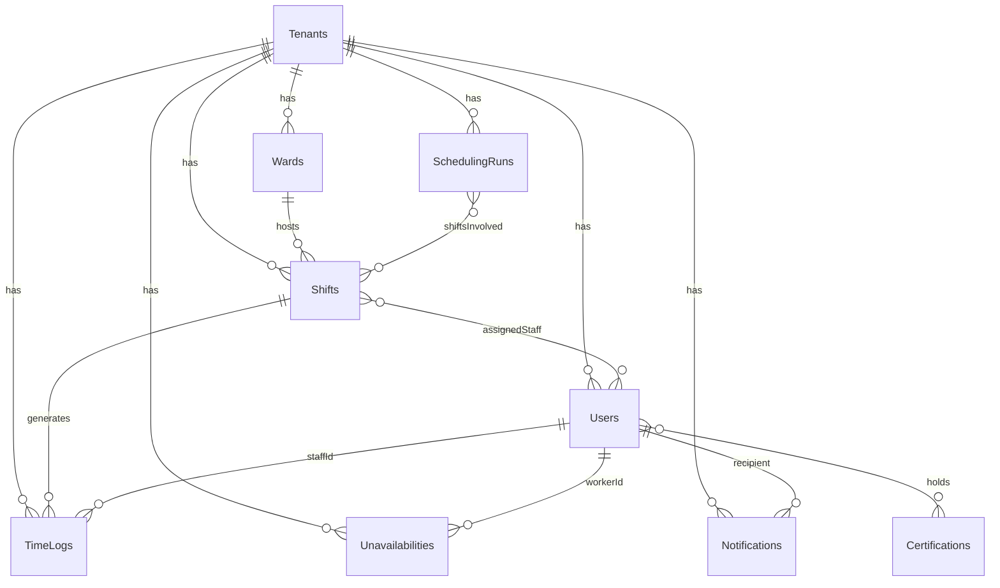

# Collections

ShiftMatrix uses [Payload CMS](https://payloadcms.com/) v2 with a PostgreSQL adapter. Each collection maps to a database table and includes field definitions, validators, access control policies, and lifecycle hooks.

Collection schema files live in `src/collections/`. They define **structure only** — business logic belongs in `src/services/`.

---

## Collection Overview

| Slug | File | Auth | Description |
|---|---|---|---|
| `users` | `Users.ts` | Yes | Staff accounts, roles, certifications |
| `tenants` | `Tenants.ts` | No | Organization accounts with settings |
| `wards` | `Wards.ts` | No | Physical ward locations with geofence config |
| `shifts` | `Shifts.ts` | No | Scheduled shifts with staffing requirements |
| `time-logs` | `TimeLogs.ts` | No | Clock-in/out events and geofence results |
| `unavailabilities` | `Unavailabilities.ts` | No | Worker unavailability requests |
| `scheduling-runs` | `SchedulingRuns.ts` | No | Job tracking table for solver runs |
| `notifications` | `Notifications.ts` | No | In-app notification messages |
| `certifications` | `Certifications.ts` | No | Master list of certifications |
| `media` | `Media.ts` | No | Payload built-in media upload collection |

---

## Detailed Schema Reference

### Users (`users`)

**File:** `src/collections/Users.ts` | **Auth:** `true`

| Field | Type | Required | Notes |
|---|---|---|---|
| `email` | `email` | Yes | Unique, used for login |
| `password` | `text` (hashed) | Yes | Payload-managed, never returned in API |
| `role` | `select` | Yes | `worker` \| `admin` \| `superadmin` |
| `tenantId` | `relationship` → `tenants` | Yes | Tenant membership |
| `firstName` | `text` | No | — |
| `lastName` | `text` | No | — |
| `phone` | `text` | No | Used for future SMS notifications |
| `certifications` | `relationship[]` → `certifications` | No | Worker's held certifications |
| `maxWeeklyHours` | `number` | No | Personal override; falls back to tenant setting |
| `preferences.unavailableDates` | `date[]` | No | ⚠️ **DEPRECATED** — use `Unavailabilities` collection |

**Access control:**

| Operation | Policy |
|---|---|
| `read` | `isSelfOrTenantAdmin` — workers read only their own record; admins read all in tenant |
| `create` | `tenantAdmins` |
| `update` | `isSelfOrTenantAdmin` |
| `delete` | `tenantAdmins` |

---

### Tenants (`tenants`)

**File:** `src/collections/Tenants.ts`

| Field | Type | Required | Notes |
|---|---|---|---|
| `name` | `text` | Yes | Display name |
| `slug` | `text` | Yes | Unique URL-safe identifier |
| `plan` | `select` | No | `free` \| `pro` \| `enterprise` |
| `settings.maxWeeklyHours` | `number` | No | Default max hours for workers in this tenant |
| `settings.activateUnionRestRules` | `checkbox` | No | Enables 12h rest constraint in CP-SAT solver |

**Access control:**

| Operation | Policy |
|---|---|
| `read` | `tenantReadAccess` — authenticated users read their own tenant |
| `create` | `isSuperAdmin` |
| `update` | `isSuperAdmin` |
| `delete` | `isSuperAdmin` |

---

### Wards (`wards`)

**File:** `src/collections/Wards.ts`

| Field | Type | Required | Notes |
|---|---|---|---|
| `name` | `text` | Yes | Ward display name (e.g., "ICU East") |
| `floor` | `text` | No | Floor or wing label |
| `tenantId` | `relationship` → `tenants` | Yes | Tenant ownership |
| `geolocation.lat` | `number` | No | Ward center latitude |
| `geolocation.lng` | `number` | No | Ward center longitude |
| `geolocation.radiusMeters` | `number` | No | Geofence radius in meters (default ~100m) |

**Access control:**

| Operation | Policy |
|---|---|
| `read` | `tenantUsers` |
| `create` / `update` / `delete` | `tenantAdmins` |

**Notes:** `geolocation` fields drive `AttendanceService.evaluateGeofence()`. If any geolocation field is null, `evaluateGeofence()` returns `'not_checked'`.

---

### Shifts (`shifts`)

**File:** `src/collections/Shifts.ts`

| Field | Type | Required | Notes |
|---|---|---|---|
| `ward` | `relationship` → `wards` | Yes | — |
| `tenantId` | `relationship` → `tenants` | Yes | — |
| `startTime` | `date` | Yes | Shift start (stored as ISO string) |
| `endTime` | `date` | Yes | Shift end |
| `status` | `select` | No | `draft` \| `open` \| `filled` \| `cancelled` |
| `assignedStaff` | `relationship[]` → `users` | No | Workers assigned after solver runs |
| `staffingRequirements` | `array` | No | Array of requirement blocks (see below) |

**Staffing requirement block types:**

Each block in `staffingRequirements` is one of:

| Block type | Fields |
|---|---|
| `RoleRequirement` | `role`, `count`, `requiredCerts[]` |
| `SpecialistReq` | `specialistType`, `requiredCerts[]` |
| `SupervisorRequirement` | `supervisorLevel`, `requiredCerts[]` |

Each block maps to one or more `SolverSlotPayload` objects when `buildSlotsForShift()` is called.

**Access control:**

| Operation | Policy |
|---|---|
| `read` | `tenantUsers` |
| `create` / `update` / `delete` | `tenantAdmins` |

---

### TimeLogs (`time-logs`)

**File:** `src/collections/TimeLogs.ts`

| Field | Type | Required | Notes |
|---|---|---|---|
| `staffId` | `relationship` → `users` | Yes | The worker who clocked in/out |
| `tenantId` | `relationship` → `tenants` | Yes | — |
| `shiftId` | `relationship` → `shifts` | Yes | Associated shift |
| `eventType` | `select` | Yes | `clock_in` \| `clock_out` \| `break_start` \| `break_end` |
| `timestamp` | `date` | Yes | Event time (set by server) |
| `geolocation.lat` | `number` | No | Worker's reported latitude at event time |
| `geolocation.lng` | `number` | No | Worker's reported longitude |
| `geofenceStatus` | `select` | No | `within_bounds` \| `outside_bounds` \| `not_checked` |
| `isLate` | `checkbox` | No | `true` if clock-in > 5 minutes after shift start |

**Access control:**

| Operation | Policy |
|---|---|
| `read` | `workerOwnsViaField('staffId')` — workers read only their own logs; admins read all in tenant |
| `create` | `anyUser` (handled by `clockInEndpoint`) |
| `update` / `delete` | `tenantAdmins` |

---

### Unavailabilities (`unavailabilities`)

**File:** `src/collections/Unavailabilities.ts`

| Field | Type | Required | Notes |
|---|---|---|---|
| `workerId` | `relationship` → `users` | Yes | The requesting worker |
| `tenantId` | `relationship` → `tenants` | Yes | — |
| `startTime` | `date` | Yes | Start of unavailability window |
| `endTime` | `date` | Yes | End of unavailability window |
| `reason` | `textarea` | No | Optional worker-provided reason |
| `status` | `select` | Yes | `pending` \| `approved` \| `rejected` |

**Access control:**

| Operation | Policy |
|---|---|
| `read` | `workerOwnsViaField('workerId')` — workers see only their own requests; admins see all in tenant |
| `create` | `anyUser` |
| `update` | `tenantAdmins` (admins approve/reject); workers cannot self-approve |
| `delete` | `tenantAdmins` |

**Note:** Only `approved` unavailabilities are included when building the solver payload.

---

### SchedulingRuns (`scheduling-runs`)

**File:** `src/collections/SchedulingRuns.ts`

This is a **job tracking table** — it records the lifecycle of each auto-fill job.

| Field | Type | Required | Notes |
|---|---|---|---|
| `jobId` | `text` | Yes | Unique UUID generated by `SchedulingService` |
| `tenantId` | `relationship` → `tenants` | Yes | — |
| `status` | `select` | Yes | `pending` \| `completed` \| `failed` |
| `errorReason` | `text` | No | Set on failure (e.g., `'infeasible_constraints'`) |
| `shiftsInvolved` | `relationship[]` → `shifts` | No | Shifts included in this run |
| `createdAt` | `date` | Auto | Payload auto-timestamps |
| `updatedAt` | `date` | Auto | — |

**Access control:**

| Operation | Policy |
|---|---|
| `read` | `tenantAdmins` |
| `create` / `update` | Internal (via Payload Local API in services) |
| `delete` | `isSuperAdmin` |

---

### Notifications (`notifications`)

**File:** `src/collections/Notifications.ts`

| Field | Type | Required | Notes |
|---|---|---|---|
| `message` | `text` | Yes | Notification body text |
| `type` | `select` | Yes | `info` \| `urgent` \| `shift_alert` |
| `recipientId` | `relationship` → `users` | Yes | The target user |
| `tenantId` | `relationship` → `tenants` | Yes | — |
| `read` | `checkbox` | No | Whether the recipient has read the notification |

**Hooks:**

- `afterChange` → calls `NotificationService.dispatchNotification(doc)` on every create/update

**Access control:**

| Operation | Policy |
|---|---|
| `read` | `tenantUsers` (filtered to own notifications via `recipientId` in UI) |
| `create` | `tenantAdmins` |
| `update` | `tenantUsers` (workers can mark as read) |
| `delete` | `tenantAdmins` |

---

### Certifications (`certifications`)

**File:** `src/collections/Certifications.ts`

| Field | Type | Required | Notes |
|---|---|---|---|
| `name` | `text` | Yes | Full name (e.g., "Registered Nurse") |
| `abbreviation` | `text` | Yes | Short form used in solver payload (e.g., "RN") |

**Access control:**

| Operation | Policy |
|---|---|
| `read` | `tenantUsers` |
| `create` / `update` / `delete` | `isSuperAdmin` |

---

## Relationship Diagram

---

## Notes on Deprecated Fields

| Collection | Field | Status | Replacement |
|---|---|---|---|
| `Users` | `preferences.unavailableDates` | ⚠️ Deprecated | Use the `Unavailabilities` collection |

The `preferences.unavailableDates` field was an early approach to tracking unavailability directly on the user document. It was replaced by the `Unavailabilities` collection to support:
- Approval workflows (`pending` / `approved` / `rejected`)
- Time-range based unavailability (not just dates)
- Per-request reason fields
- Proper access control (workers cannot self-approve)

**Do not read `preferences.unavailableDates` in any new code.** The solver payload builder reads only from the `Unavailabilities` collection.
