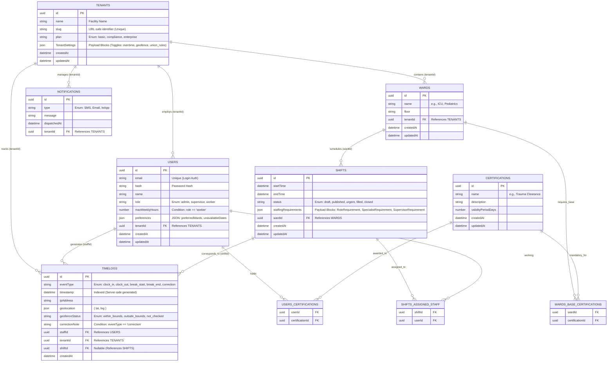

# ShiftMatrix

## Architecture Decisions

1. **Database:** PostgreSQL via NeonDB. This offers robust relational integrity, crucial for the complex constraint systems. Payload 3.x supports Postgres natively via `@payloadcms/db-postgres`.
2. **Authentication & Scalability (Users vs. Staff):** To maximize scalability and avoid complicated cross-collection authentication, the `Staff` collection is merged directly into the core `Users` collection. Differentiating admins, supervisors, and workers will be handled via a `role` field.
3. **Multi-Tenant Row Level Security (RLS):** RLS will be enforced at the Payload application layer using Payload's `access` control hooks, ensuring that database queries inherently filter out records not belonging to the authenticated user's `tenantId`.

## Entity-Relationship Diagram (ERD)

The following ERD presents a highly detailed view of the schema, reflecting the exact data types, relationships, and Payload-specific structures (like Blocks and Arrays) that will be implemented.

## Proposed Changes: Collections & Row Level Security (RLS)

All collections will implement strict RLS using Payload's `access` control. 

### Global RLS Policy Strategy
To ensure multi-tenant isolation, every access control function (except for Super Admins) will automatically inject a `where` constraint filtering by `tenantId: { equals: req.user.tenantId }`.

#### 1. [NEW] `Users` Collection (Combines Staff & Authentication)
- **Fields:** `email`, `password`, `name`, `role`, `tenantId`, `maxWeeklyHours`, `preferences`, `certifications` (Relationship array).
- **RLS Access:** 
  - `read`: Admins can read all Users in their `tenantId`. Workers can read their own profile.
  - `update`: Admins can update any User in their `tenantId`. Workers can only update their `preferences`.
  - `create`/`delete`: Admin only.

#### 2. [NEW] `Tenants` Collection
- **Fields:** `name`, `slug`, `plan`, `TenantSettings` (Blocks).
- **RLS Access:** 
  - `read`: Any authenticated user can read their own `tenantId` document (needed to render UI).
  - `update`: Admin only (limited fields based on plan).

#### 3. [NEW] `Wards` & `Certifications` Collections
- **Wards Fields:** `name`, `floor`, `tenantId`, `requiredBaseCertifications` (Relationship array).
- **Certifications Fields:** Global catalog or tenant-specific catalog depending on requirements. Assuming global `name`, `description`, `validityPeriodDays`.
- **RLS Access:** 
  - `read`: All authenticated users in the `tenantId` can read.
  - `update`/`create`/`delete`: Admin only.

#### 4. [NEW] `Shifts` Collection
- **Fields:** `ward`, `startTime`, `endTime`, `status`, `assignedStaff` (Relationship array), `staffingRequirements` (Payload Blocks).
- **RLS Access:** 
  - `read`: Admins/Supervisors can read all shifts in their `tenantId`. Workers can read shifts where they are in `assignedStaff`, or shifts marked `status: 'urgent'` (for bidding).
  - `update`: Admins only. (Workers can "bid" via a separate custom API endpoint that bypasses RLS safely using `overrideAccess: true` to append their ID).

#### 5. [NEW] `TimeLogs` Collection
- **Fields:** `staffId`, `tenantId`, `shiftId`, `eventType`, `timestamp`, `ipAddress`, `geolocation`, `geofenceStatus`.
- **RLS Access:** 
  - `read`: Admins can read all logs in their `tenantId`. Workers can read their own logs.
  - `create`: Controlled via a secure custom API endpoint (capturing server-side timestamps). Users CANNOT directly POST to this collection via the standard Payload REST API.
  - `update`/`delete`: Forbidden for all (append-only ledger). Edits require new logs with `eventType: 'correction'`.

## Verification Plan

### Automated Tests
- Test RLS constraints: Verify a user from Tenant A cannot fetch records belonging to Tenant B.
- Test TimeLog integrity: Ensure direct REST API updates to `TimeLogs` are rejected, and only the secure custom clock-in endpoint works.

### Manual Verification
- Seed the NeonDB instance with two separate Tenants and dummy data.
- Login as an Admin and verify visibility is scoped strictly to their tenant.
- Verify the ERD structures map cleanly to the generated Postgres tables and Junction tables in NeonDB.
